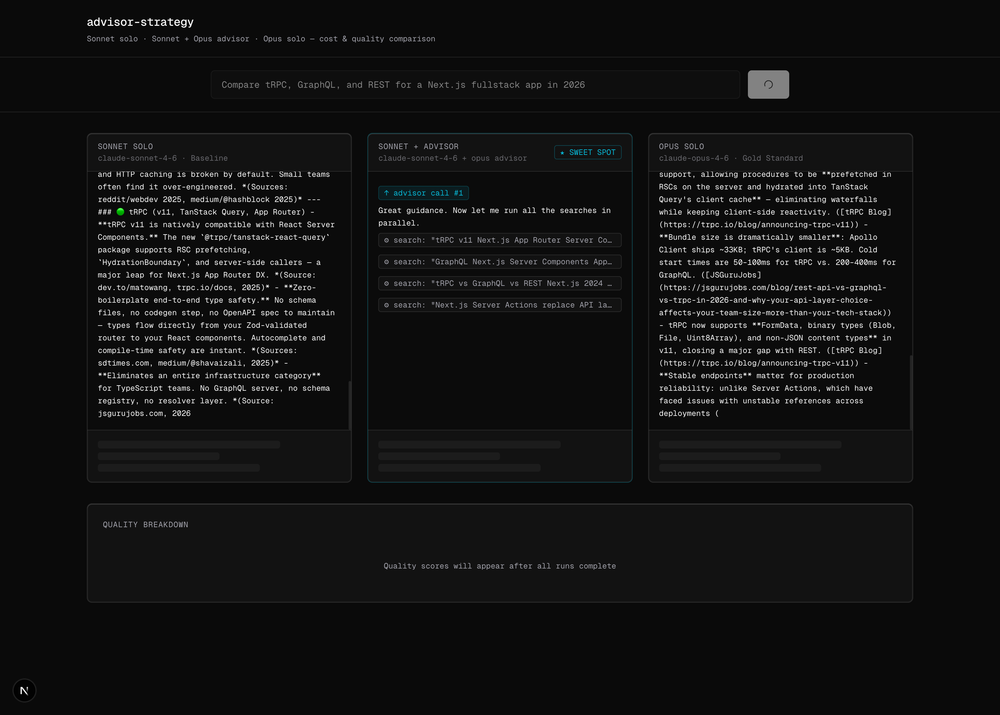
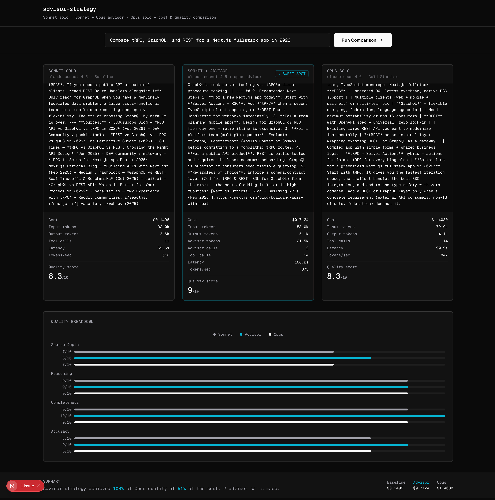

# advisor-strategy

A live benchmark comparing three model configurations on the same research query — streaming in parallel, with full cost, latency, and quality metrics.



*Three agents running simultaneously. The center column shows an advisor call badge mid-stream — Sonnet escalating to Opus for a complex decision before continuing its research loop.*

## What it shows

| Configuration | Cost | Quality | Notes |
|---|---|---|---|
| **Sonnet solo** | $0.24 | 8.0/10 | Baseline — full agentic loop, no advisor |
| **Sonnet + Opus advisor** | $0.50 | 8.5/10 | Sweet spot — Opus consulted 2× on hard decisions |
| **Opus solo** | $0.89 | 7.8/10 | Gold standard — full frontier cost |

Sonnet + Advisor achieved higher quality than Opus solo at 56% of the cost.

---

## The Advisor Strategy

The [Advisor Strategy](https://claude.com/blog/the-advisor-strategy) is a multi-model orchestration pattern where a capable executor model (Sonnet) drives the full agentic loop, but escalates to a more powerful model (Opus) via a dedicated tool call — only for decisions that actually warrant it.

```json
{
  "type": "advisor_20260301",
  "name": "advisor",
  "model": "claude-opus-4-6",
  "max_uses": 5
}
```

Required beta header: `anthropic-beta: advisor-tool-2026-03-01`

The executor stays in control. The advisor provides targeted judgment exactly where it changes the result. Advisor calls surface in the stream as `server_tool_use`; token cost lands in `message_delta.usage.iterations[]` where `type === "advisor_message"`, split into input/output for accurate billing at Opus rates ($15/$75 per million).

---

## Full results



The bottom panel shows per-dimension quality scores (source depth, reasoning, completeness, accuracy) judged by a separate Opus call after all three runs complete. The summary bar compares cost side-by-side.

---

## Stack

- **Next.js 15** — App Router, Server Components, route handlers
- **TypeScript** — end to end
- **Tailwind CSS v4** — custom design tokens via `@theme`
- **Anthropic SDK** — baseline and Opus agents via `@anthropic-ai/sdk`
- **Raw fetch** — advisor agent (SDK doesn't yet expose the advisor tool natively)
- **Brave Search API** — web search tool execution
- **SSE** — three parallel streaming agent runs to the client

## Project structure

```
app/
  page.tsx                   # Main UI — query input, three-column grid, quality chart
  api/
    research/
      baseline/route.ts      # Sonnet solo agent — SSE stream
      advisor/route.ts       # Sonnet + Opus advisor agent — SSE stream
      opus/route.ts          # Opus solo agent — SSE stream
    judge/route.ts           # Quality scoring — Opus as judge
components/
  ComparisonGrid.tsx          # Three-column layout
  AgentColumn.tsx             # Per-agent streaming output + metrics
  MetricsCard.tsx             # Cost / tokens / latency display
  QualityChart.tsx            # Dimension breakdown bar chart
lib/
  agents/
    baseline-agent.ts         # Sonnet agentic loop (SDK streaming)
    advisor-agent.ts          # Sonnet + advisor loop (raw fetch, beta header)
    opus-agent.ts             # Opus agentic loop (SDK streaming)
    shared.ts                 # System prompts, tool definitions, web search/fetch
  metrics.ts                  # Pricing constants, cost calculation, formatters
  types.ts                    # Shared TypeScript types
```

## Setup

```bash
git clone https://github.com/popand/advisor-strategy
cd advisor-strategy
npm install
```

Create `.env.local`:

```bash
ANTHROPIC_API_KEY=sk-ant-...
BRAVE_API_KEY=...           # optional — falls back to placeholder results
```

```bash
npm run dev
```

Open [http://localhost:3000](http://localhost:3000), enter a research query, and click **Run Comparison**.

## Notes

- The advisor feature requires beta access: `anthropic-beta: advisor-tool-2026-03-01`
- All three agents run in parallel — expect the full comparison to take 60–120 seconds depending on query complexity
- Web search falls back to a placeholder if `BRAVE_API_KEY` is not set; agents still run using training knowledge
- Quality scores are judged by a separate Opus call after all three runs complete — expect some variance across runs

## References

- [The Advisor Strategy — Anthropic Blog](https://claude.com/blog/the-advisor-strategy)
- [Anthropic API Docs](https://docs.anthropic.com)

---

Built by [Andrei Pop](https://www.linkedin.com/in/andreipop/) · Principal Engineer, [Alethia](https://alethiaintel.com)

> Alethia Prism is the intelligence layer that identifies what is forming across systems, context, and time — so organizations can act before outcomes harden.
